# The Mythical Man-Month, 2027

*stormcos: an operating system, Kubernetes, storage and networking stack written by one person and a fleet of AI coding sessions.*

**54 repositories · 559,317 lines of shipped code · 96.2% Rust · 232 days, 2026-02-17 to 2026-10-07**

**3,923 issues · about 65 hours of human time** (at one minute per issue: reading it and answering or approving), **≈ 8,554 shipped lines per human hour**, about 17 minutes a day over 232 days.

Counted from each repository's own source (`git ls-files`, `measure.py`): code lines only, no blanks or comments, and **only what the project ships**. Excluded: tests (test directories, fixtures, test data, benches, examples, Rust's inline `#[cfg(test)]` modules), build, CI and tooling scripts (`deploy/`, `scripts/`, `tools/`, `hack/`, `packaging/`, `ci/`, `.github/`, `xtask/`, root-level `ci-*.sh` and `build*.sh`, image-build and code-generation helpers, models and conformance helpers, `build.rs`, Makefiles), vendored code and docs. Human time assumes one minute of a person's attention per issue (every piece of work starts as an issue); the coding itself is done by AI sessions. Days run from a repository's first commit to its latest, inclusive. Snapshot: 2026-10-07.

| Area | Repository | What it is | Main language | Rust | Code lines | First commit | Last commit | Days | Issues | Human time |
|---|---|---|---|---:|---:|---|---|---:|---:|---:|
| product | [stormcos](https://github.com/glennswest/stormcos) | stormcos — the platform's one operating system. An image-based node OS | Rust | 100% | 319 | 2026-07-16 | 2026-10-07 | 83 | 392 | 6 h 32 m |
| qa | [stormcos_qa](https://github.com/glennswest/stormcos_qa) | stormcos QA: test standard, runner (auto-files issues), and must-gather; tombstones failed images | Rust | 99% | 6,360 | 2026-07-19 | 2026-10-07 | 80 | 54 | 54 m |
| boot | [stormbootx](https://github.com/glennswest/stormbootx) | A UEFI NVMe/TCP boot extension: boot a machine from a remote image with no kernel, no initramfs and no PXE | Rust | 100% | 8,661 | 2026-09-02 | 2026-10-07 | 35 | 110 | 1 h 50 m |
| boot | [stormnic-ixgbe](https://github.com/glennswest/stormnic-ixgbe) | Rust no_std UEFI SNP driver for Intel 82599/X540/X552 10G, loaded by stormbootx | Rust | 100% | 4,326 | 2026-09-27 | 2026-10-07 | 10 | 32 | 32 m |
| boot | [stormnic-mlx4](https://github.com/glennswest/stormnic-mlx4) | Rust no_std UEFI SNP driver for Mellanox ConnectX-3, loaded by stormbootx | Rust | 100% | 3,584 | 2026-09-27 | 2026-10-07 | 10 | 24 | 24 m |
| boot | [stormnic-virtio](https://github.com/glennswest/stormnic-virtio) | Rust no_std UEFI SNP driver for virtio-net (modern, virtio 1.x), loaded by stormbootx | Rust | 100% | 2,522 | 2026-10-06 | 2026-10-07 | 1 | 2 | 2 m |
| boot | [stormuefi](https://github.com/glennswest/stormuefi) | Read-only stormblock asset reader for UEFI — descriptor + extent map, resolved before the kernel exists | Rust | 100% | 1,567 | 2026-08-19 | 2026-10-07 | 49 | 44 | 44 m |
| control-plane | [fastetcd](https://github.com/glennswest/fastetcd) | Rust, wire-compatible replacement for etcd v3. Multi-node Raft. Targets realtime / low-overhead environments. | Rust | 100% | 18,615 | 2026-05-18 | 2026-10-07 | 142 | 136 | 2 h 16 m |
| control-plane | [rustkube](https://github.com/glennswest/rustkube) | K8s API-compatible container orchestrator in Rust | Rust | 100% | 31,073 | 2026-03-18 | 2026-10-07 | 204 | 233 | 3 h 53 m |
| control-plane | [stormcert](https://github.com/glennswest/stormcert) | Certificate plane for the Storm platform - issue, renew, deliver, reload, verify. Rust. | Rust | 100% | 9,744 | 2026-08-26 | 2026-10-06 | 42 | 70 | 1 h 10 m |
| control-plane | [stormlb](https://github.com/glennswest/stormlb) | Rust API/ingress VIP load balancer for the Storm stack — health-checked L4 + VRRP (L2) / BGP-anycast (L3). The pre-cluster control-plane LB. | Rust | 100% | 2,940 | 2026-07-20 | 2026-10-07 | 80 | 28 | 28 m |
| network | [flowsdn](https://github.com/glennswest/flowsdn) | flowsdn is a Rust networking stack for stormcos, implementing a CNI plugin and | Rust | 100% | 43,305 | 2026-09-07 | 2026-10-07 | 31 | 354 | 5 h 54 m |
| network | [network-operator](https://github.com/glennswest/network-operator) | Cluster Network Operator for the rustkube/stormcos stack — manages the Cilium CNI lifecycle from a Network CR (install/upgrade/reconcile/status). CNO-equivalent, in Rust. | Rust | 100% | 3,469 | 2026-07-20 | 2026-10-06 | 79 | 30 | 30 m |
| network | [stormcoredns](https://github.com/glennswest/stormcoredns) | CoreDNS reimplemented in Rust: Corefile, plugin chain, and the full plugin set | Rust | 100% | 14,457 | 2026-08-29 | 2026-10-07 | 39 | 27 | 27 m |
| node | [cadvisor](https://github.com/glennswest/cadvisor) | Container metrics exporter (cadvisor-compatible) for the rustkube stack, in Rust | Rust | 100% | 5,141 | 2026-07-16 | 2026-10-07 | 83 | 22 | 22 m |
| node | [rustkube-node](https://github.com/glennswest/rustkube-node) | Node level of rustkube (Rust Kubernetes): kubelet, kube-proxy, cni | Rust | 100% | 28,502 | 2026-07-15 | 2026-10-07 | 85 | 189 | 3 h 09 m |
| node | [stormcast](https://github.com/glennswest/stormcast) | The emit half of the storm log path: one wire format, never blocking. | Rust | 100% | 407 | 2026-08-25 | 2026-10-07 | 43 | 12 | 12 m |
| node | [stormimds](https://github.com/glennswest/stormimds) | Instance Metadata Service — the endpoint a guest asks who it is | Rust | 100% | 1,791 | 2026-09-10 | 2026-10-06 | 27 | 20 | 20 m |
| node | [stormipmi](https://github.com/glennswest/stormipmi) | Bare-metal host management for stormcos: Redfish/IPMI power, discovery, PXE-free NVMe/TCP install, always-on SOL console — a rustkube operator | Rust | 100% | 11,132 | 2026-09-22 | 2026-10-07 | 15 | 67 | 1 h 07 m |
| node | [stormpump](https://github.com/glennswest/stormpump) | The node's execution engine — start and stop, in milliseconds. PID1 and CRI-O replacement for stormcos. | Rust | 100% | 23,035 | 2026-08-20 | 2026-10-07 | 48 | 102 | 1 h 42 m |
| node | [stormrdp](https://github.com/glennswest/stormrdp) | The server side of RDP, in Rust: VM consoles, Linux desktops and Windows | Rust | 98% | 5,321 | 2026-09-22 | 2026-10-07 | 15 | 39 | 39 m |
| node | [stormvm](https://github.com/glennswest/stormvm) | First-class VMs on stormcos: the VM object, the hypervisor drivers, and everything a VM needs that stormpump and stormblock do not own. | Rust | 100% | 10,605 | 2026-08-28 | 2026-10-07 | 40 | 80 | 1 h 20 m |
| node | [vmcloud-image-operator](https://github.com/glennswest/vmcloud-image-operator) | The cloud-image catalogue and golden lifecycle for a stormcos cluster. On a | Rust | 100% | 5,109 | 2026-09-20 | 2026-10-07 | 17 | 43 | 43 m |
| storage | [fio.dos.rs](https://github.com/glennswest/fio.dos.rs) | Async userspace file I/O into FAT12/FAT16/FAT32 — read and write files with no kernel, no mount, no loop device | Rust | 100% | 1,525 | 2026-08-20 | 2026-10-07 | 49 | 4 | 4 m |
| storage | [fio.ext4.rs](https://github.com/glennswest/fio.ext4.rs) | Async userspace file I/O into ext2/ext3/ext4 — read and write files with no kernel, no mount, no loop device | Rust | 100% | 3,282 | 2026-08-12 | 2026-10-06 | 56 | 10 | 10 m |
| storage | [fio.xfs.rs](https://github.com/glennswest/fio.xfs.rs) | Async userspace file I/O into XFS — read and write files with no kernel, no mount, no loop device | Rust | 100% | 4,558 | 2026-09-25 | 2026-10-07 | 12 | 17 | 17 m |
| storage | [mkfs.dos.rs](https://github.com/glennswest/mkfs.dos.rs) | Async FAT12/FAT16/FAT32 formatter and checker in pure Rust — a from-scratch reimplementation of mkfs.fat and fsck.fat | Rust | 100% | 3,040 | 2026-08-20 | 2026-10-06 | 48 | 4 | 4 m |
| storage | [mkfs.ext4.rs](https://github.com/glennswest/mkfs.ext4.rs) | Async, parallel ext2/ext3/ext4 formatter and checker in pure Rust — a from-scratch reimplementation of mke2fs and e2fsck | Rust | 100% | 11,420 | 2026-08-12 | 2026-10-07 | 56 | 21 | 21 m |
| storage | [mkfs.xfs.rs](https://github.com/glennswest/mkfs.xfs.rs) | Async XFS formatter and checker in pure Rust — a from-scratch reimplementation of mkfs.xfs and xfs_repair -n | Rust | 100% | 3,311 | 2026-09-25 | 2026-10-06 | 12 | 11 | 11 m |
| storage | [stormblock](https://github.com/glennswest/stormblock) | Pure Rust enterprise block storage engine — NVMe-oF/TCP + iSCSI targets with software RAID | Rust | 98% | 70,437 | 2026-02-17 | 2026-10-07 | 232 | 334 | 5 h 34 m |
| storage | [stormblock-csi](https://github.com/glennswest/stormblock-csi) | A CSI driver and a wandering-RAID1 operator for StormBlock, in Rust. A | Rust | 100% | 7,117 | 2026-07-16 | 2026-10-07 | 83 | 48 | 48 m |
| storage | [stormblock-registry](https://github.com/glennswest/stormblock-registry) | An OCI registry that turns each pushed image into a golden: a sealed | Rust | 100% | 23,439 | 2026-08-07 | 2026-10-07 | 61 | 98 | 1 h 38 m |
| storage | [stormdrive](https://github.com/glennswest/stormdrive) | Physical drive management for one storage node. stormdrive knows what the | Rust | 91% | 15,417 | 2026-08-26 | 2026-10-07 | 43 | 57 | 57 m |
| storage | [stormstorage](https://github.com/glennswest/stormstorage) | The storage control plane across Storm nodes and clusters. | Rust | 98% | 8,371 | 2026-08-26 | 2026-10-07 | 42 | 62 | 1 h 02 m |
| platform | [stormcluster](https://github.com/glennswest/stormcluster) | stormcos day-2 cluster operator: discover peers, form a cluster (masters/workers), join and split nodes (a split node reverts to SNO) | Rust | 100% | 6,228 | 2026-10-01 | 2026-10-07 | 6 | 41 | 41 m |
| platform | [stormupdate](https://github.com/glennswest/stormupdate) | stormcos updater: watch the release catalog and upgrade a running cluster to the next release, every level (OS pallets, kernel, goldens, Kubernetes), node by node with drain, health gates and rollback | Rust | 100% | 4,172 | 2026-10-01 | 2026-10-06 | 6 | 14 | 14 m |
| options | [irondirectory](https://github.com/glennswest/irondirectory) | A FIPS-compliant, Active Directory–compatible identity provider written in | Rust | 100% | 9,356 | 2026-06-29 | 2026-10-06 | 100 | 43 | 43 m |
| options | [irondirectory-operator](https://github.com/glennswest/irondirectory-operator) | stormcos operator for irondirectory: instances, drives, fleet | Rust | 100% | 1,320 | 2026-09-27 | 2026-10-06 | 10 | 9 | 9 m |
| options | [nextnfs](https://github.com/glennswest/nextnfs) | High-performance, standalone NFSv4.0/4.1 server over a real filesystem, written in Rust. Runs as a static musl binary… | Rust | 100% | 14,817 | 2026-03-22 | 2026-10-07 | 200 | 64 | 1 h 04 m |
| options | [nextnfs-operator](https://github.com/glennswest/nextnfs-operator) | stormcos operator for nextnfs: instances, drives, fleet | Rust | 100% | 1,304 | 2026-09-27 | 2026-10-07 | 10 | 15 | 15 m |
| options | [rocketsmbd](https://github.com/glennswest/rocketsmbd) | High-performance smbd replacement in Rust: io_uring end-to-end, zero-copy file-to-socket | Rust | 100% | 7,237 | 2026-06-09 | 2026-10-07 | 120 | 79 | 1 h 19 m |
| options | [rocketsmbd-operator](https://github.com/glennswest/rocketsmbd-operator) | stormcos operator for rocketsmbd: instances, drives, fleet | Rust | 100% | 1,921 | 2026-09-27 | 2026-10-06 | 10 | 6 | 6 m |
| options | [stormcos-options](https://github.com/glennswest/stormcos-options) | stormcos operator for stormcos: instances, drives, fleet | Rust | 100% | 1,653 | 2026-09-27 | 2026-10-07 | 10 | 9 | 9 m |
| ui | [stormcentral](https://github.com/glennswest/stormcentral) | StormCOS mission control: component issues and releases, and a Claude session per project | Rust | 84% | 38,675 | 2026-09-24 | 2026-10-07 | 14 | 547 | 9 h 07 m |
| ui | [stormconsole](https://github.com/glennswest/stormconsole) | StormCOS web console — pluggable OpenShift-style console built on stormd and stormview | Rust | 64% | 25,769 | 2026-08-26 | 2026-10-07 | 43 | 118 | 1 h 58 m |
| ui | [stormrfb](https://github.com/glennswest/stormrfb) | RFB (RFC 6143) in Rust — sans-I/O codec, a client for stormconsole and a server for the Rust VMM's display | Rust | 93% | 2,985 | 2026-09-09 | 2026-10-07 | 29 | 23 | 23 m |
| ui | [stormview](https://github.com/glennswest/stormview) | The storm view contract and UI system: one shape every storm daemon | Svelte | 10% | 1,925 | 2026-08-26 | 2026-10-06 | 42 | 20 | 20 m |
| tooling | [minismbd](https://github.com/glennswest/minismbd) | Admin/boot-media SMB server: read-only, client allowlist, SMB1+SMB2, time-boxed — spun off rocketsmbd | Rust | 100% | 6,112 | 2026-09-27 | 2026-10-07 | 10 | 20 | 20 m |
| tooling | [sc](https://github.com/glennswest/sc) | One binary for a StormCOS fleet, covering three surfaces an operator should | Rust | 100% | 2,798 | 2026-09-08 | 2026-10-07 | 29 | 20 | 20 m |
| tooling | [stormd](https://github.com/glennswest/stormd) | A container init for scratch images: one static binary that is PID 1, | Rust | 92% | 13,349 | 2026-02-28 | 2026-10-07 | 222 | 48 | 48 m |
| not yet in an area | [sectionsystems](https://github.com/glennswest/sectionsystems) | sectionsystems: StormCOS operator that verifies each node against the manifest it carries, at boot and at unpredictable intervals; serves sc verify and a status endpoint | Rust | 100% | 2,289 | 2026-10-02 | 2026-10-07 | 5 | 8 | 8 m |
| not yet in an area | [storminstall](https://github.com/glennswest/storminstall) | StormCOS installer: author install-config.yaml (TUI), write it into the boot ISO's config volume, download the ISO and sc, and watch the first node's install — Linux, macOS, Windows | Rust | 100% | 4,215 | 2026-10-02 | 2026-10-07 | 5 | 16 | 16 m |
| not yet in an area | [stormpanel](https://github.com/glennswest/stormpanel) | stormpanel: a graphical node status panel drawn directly on the console with KMS/DRM — temperatures, CPU, memory, disks, network, power, storage and cluster health, for servers and laptops | Rust | 100% | 4,047 | 2026-10-02 | 2026-10-06 | 4 | 3 | 3 m |
| not yet in an area | [stormraid](https://github.com/glennswest/stormraid) | stormraid: high-performance RAID for pve and stormcos: writes at RAID0 speed with ECC written alongside the data, asynchronous ECC verification, and three-level bit-rot checking | Rust | 100% | 15,243 | 2026-10-03 | 2026-10-07 | 5 | 44 | 44 m |

| | **Total** | | | **96.2%** | **559,317** | **2026-02-17** | **2026-10-07** | **232** | **3,923** | **65 h 23 m** |

## By language (shipped code)

| Language | Code lines | Share |
|---|---:|---:|
| Rust | 538,027 | 96.2% |
| Svelte | 16,111 | 2.9% |
| JavaScript | 2,347 | 0.4% |
| CSS | 1,503 | 0.3% |
| HTML | 842 | 0.2% |
| Shell | 487 | 0.1% |

## What isn't Rust

Everything stormcos ships that isn't Rust is browser code for the web UIs, plus a few hundred lines of shell:

| Language | Code lines | Where it ships |
|---|---:|---|
| Svelte | 16,111 | the web UIs: stormcentral, stormconsole, stormdrive, stormd, stormview |
| JavaScript | 2,347 | the same UIs, and stormrfb's browser client |
| CSS | 1,503 | the web UIs |
| HTML | 842 | the web UIs |
| Shell | 487 | must-gather's collector scripts (stormcos_qa) and flowsdn's install check |

There is no Go and no Python in anything stormcos ships.

Not counted, because they are not part of stormcos: **baremetalservices** (a separate utility, its own Linux boot environment), **dellsw** (switch tooling) and **buildbox2** (the build machine image). Repositories not yet started are left out until they hold code.

## How the components connect

Arrows mean *uses*, taken from each project's declared dependencies in stormcentral. Dotted arrows go to **stormd**, the process supervisor most services run under. Not drawn: **stormcos** itself, which composes every component into the release image, and the **stormview** UI library.

```mermaid
flowchart TB
  subgraph boot["Boot"]
    stormbootx["stormbootx"]
    stormnic_ixgbe["stormnic-ixgbe"]
    stormnic_mlx4["stormnic-mlx4"]
    stormnic_virtio["stormnic-virtio"]
    stormuefi["stormuefi"]
  end
  subgraph node["Node"]
    cadvisor["cadvisor"]
    rustkube_node["rustkube-node"]
    stormcast["stormcast"]
    stormimds["stormimds"]
    stormipmi["stormipmi"]
    stormpump["stormpump"]
    stormrdp["stormrdp"]
    stormvm["stormvm"]
    vmcloud_image_operator["vmcloud-image-operator"]
  end
  subgraph storage["Storage"]
    fio_dos_rs["fio.dos.rs"]
    fio_ext4_rs["fio.ext4.rs"]
    fio_xfs_rs["fio.xfs.rs"]
    mkfs_dos_rs["mkfs.dos.rs"]
    mkfs_ext4_rs["mkfs.ext4.rs"]
    mkfs_xfs_rs["mkfs.xfs.rs"]
    stormblock["stormblock"]
    stormblock_csi["stormblock-csi"]
    stormblock_registry["stormblock-registry"]
    stormdrive["stormdrive"]
    stormraid["stormraid"]
    stormstorage["stormstorage"]
  end
  subgraph control_plane["Control plane"]
    fastetcd["fastetcd"]
    rustkube["rustkube"]
    stormcert["stormcert"]
    stormlb["stormlb"]
  end
  subgraph network["Network"]
    flowsdn["flowsdn"]
    network_operator["network-operator"]
    stormcoredns["stormcoredns"]
  end
  subgraph platform["Platform"]
    stormcluster["stormcluster"]
    stormupdate["stormupdate"]
  end
  subgraph options["Options"]
    irondirectory["irondirectory"]
    irondirectory_operator["irondirectory-operator"]
    nextnfs["nextnfs"]
    nextnfs_operator["nextnfs-operator"]
    rocketsmbd["rocketsmbd"]
    rocketsmbd_operator["rocketsmbd-operator"]
    stormcos_options["stormcos-options"]
  end
  subgraph ui["UI"]
    stormcentral["stormcentral"]
    stormconsole["stormconsole"]
    stormrfb["stormrfb"]
    stormview["stormview"]
  end
  subgraph tooling["Tooling"]
    minismbd["minismbd"]
    sc["sc"]
    stormd["stormd"]
  end
  subgraph product["Product"]
    stormcos["stormcos"]
  end
  subgraph qa["QA"]
    stormcos_qa["stormcos_qa"]
  end
  subgraph other["Other"]
    sectionsystems["sectionsystems"]
    storminstall["storminstall"]
    stormpanel["stormpanel"]
  end
  flowsdn --> rustkube_node
  irondirectory --> fastetcd
  irondirectory_operator --> irondirectory
  irondirectory_operator --> stormcos_options
  network_operator --> rustkube
  nextnfs -.-> stormd
  nextnfs_operator --> nextnfs
  nextnfs_operator --> stormcos_options
  rocketsmbd -.-> stormd
  rocketsmbd_operator --> rocketsmbd
  rocketsmbd_operator --> stormcos_options
  rustkube --> fastetcd
  rustkube --> stormcert
  rustkube --> stormlb
  rustkube -.-> stormd
  rustkube_node --> rustkube
  rustkube_node --> stormpump
  rustkube_node --> stormvm
  sc --> rustkube
  sectionsystems --> stormcos
  stormblock_csi --> stormblock
  stormblock_csi --> rustkube
  stormblock_registry --> stormblock
  stormblock_registry -.-> stormd
  stormbootx --> stormblock
  stormbootx --> stormnic_ixgbe
  stormbootx --> stormnic_mlx4
  stormbootx --> stormnic_virtio
  stormcert -.-> stormd
  stormcluster --> stormcos
  stormcluster --> rustkube
  stormcluster --> fastetcd
  stormcluster --> stormcert
  stormcluster --> stormlb
  stormcluster --> stormconsole
  stormconsole --> rustkube
  stormconsole --> stormrfb
  stormconsole -.-> stormd
  stormcoredns -.-> stormd
  stormcos_options --> rustkube
  stormcos_qa --> stormcos
  stormcos_qa --> stormblock_csi
  stormd --> stormcast
  stormdrive --> stormblock
  stormdrive -.-> stormd
  stormimds -.-> stormd
  storminstall --> stormbootx
  storminstall --> sc
  stormipmi --> rustkube
  stormipmi -.-> stormd
  stormlb -.-> stormd
  stormpanel --> stormpump
  stormpump --> stormcast
  stormpump --> stormblock
  stormpump --> stormblock_registry
  stormrdp --> stormvm
  stormstorage --> stormblock
  stormstorage --> stormdrive
  stormstorage -.-> stormd
  stormuefi --> stormblock
  stormupdate --> stormcos
  stormupdate --> stormblock
  stormupdate --> rustkube
  stormupdate --> stormconsole
  stormvm --> stormpump
  stormvm --> stormblock
  vmcloud_image_operator --> stormvm
```

